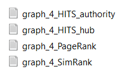

<p align=center>
    
</p>

<p align=center>
    <a target="_blank" href="https://travis-ci.com/chonyy/AI-basketball-analysis" title="Build Status"></a>
    <a target="_blank" href="#" title="language count"></a>
    <a target="_blank" href="#" title="top language"></a>
    <a target="_blank" href="https://opensource.org/licenses/MIT" title="License: MIT"></a>
    <a target="_blank" href="#" title="repo size"></a>
    <a target="_blank" href="http://makeapullrequest.com" title="PRs Welcome"></a>
</p>

> 🎏 Python implementation of famous link analysis algorithms.

I have written three articles to explain the concept and implementation of these three algorithms. Feel free to click on the link!

- [HITS Algorithm](https://towardsdatascience.com/hits-algorithm-link-analysis-explanation-and-python-implementation-61f0762fd7cf)
- [PageRank Algorithm](https://towardsdatascience.com/pagerank-3c568a7d2332)
- [SimRank Algorithm](https://towardsdatascience.com/simrank-similarity-analysis-1d8d5a18766a)

## 💻 Getting Started

Get a copy of this repo using git clone
```
git clone https://github.com/chonyy/PageRank-HITS-SimRank.git
```

Run the program with dataset provided and **default** values for *damping_factor* = 0.15, *decay_factor* = 0.9 and *iteration* = 100

```
python main.py -f 'dataset/graph_1.txt'
```

Run program with dataset and cusotm parameters

```
python main.py --input_file 'dataset/graph_1.txt' --damping_factor 0.15 --decay_factor 0.9 --iteration 500
```

## Result

### Output on console

<p align=center>
    
</p>

The order of the result follows the order of the node value. For example, `1, 2, 5, 7`.

### Output to files in result folder

<p align=center>
    
</p>

A new folder with the name same with the graph will be created in the result directory. Four txt files will be created to store the value printed on the console.

- graph_HITS_authority.txt
- graph_HITS_hub.txt
- graph_PageRank.txt
- graph_SimRank.txt

## Analysis

<p align=center>
    
    
    
    
</p>
